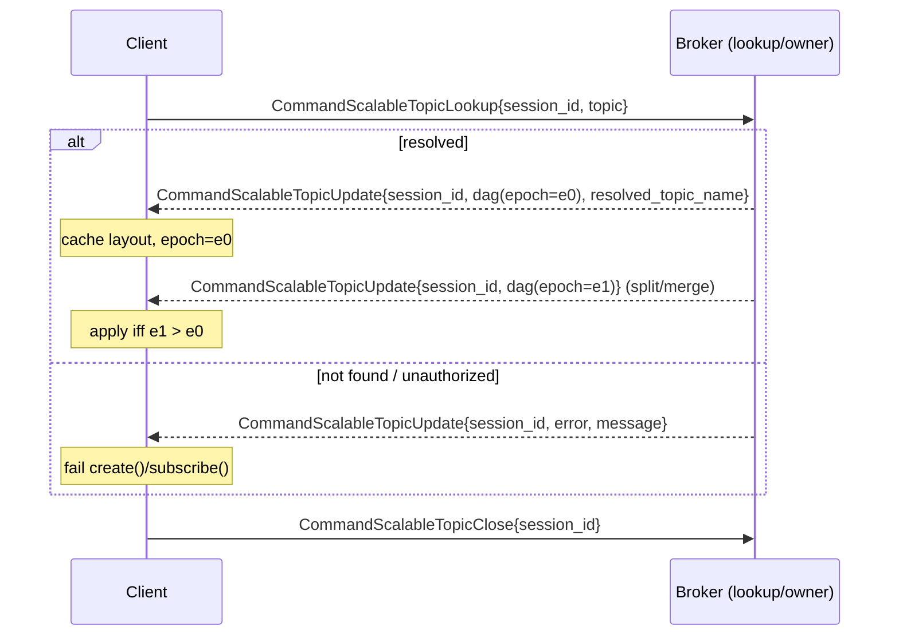
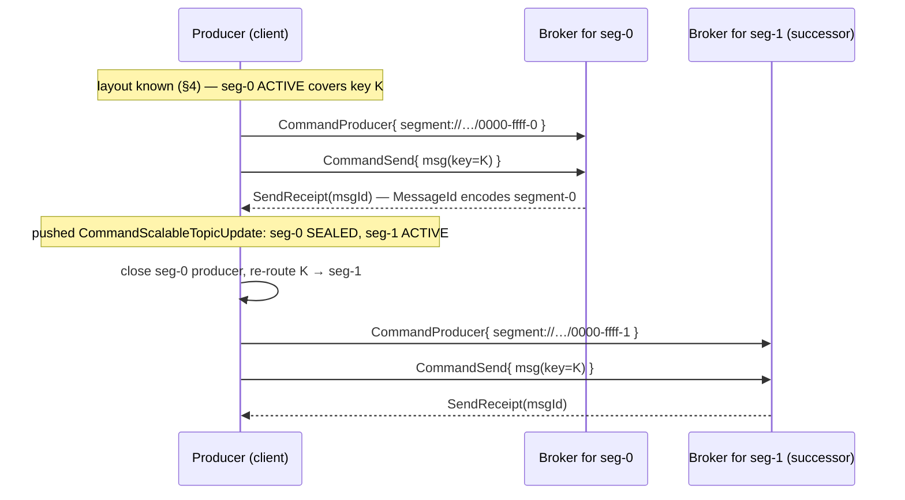
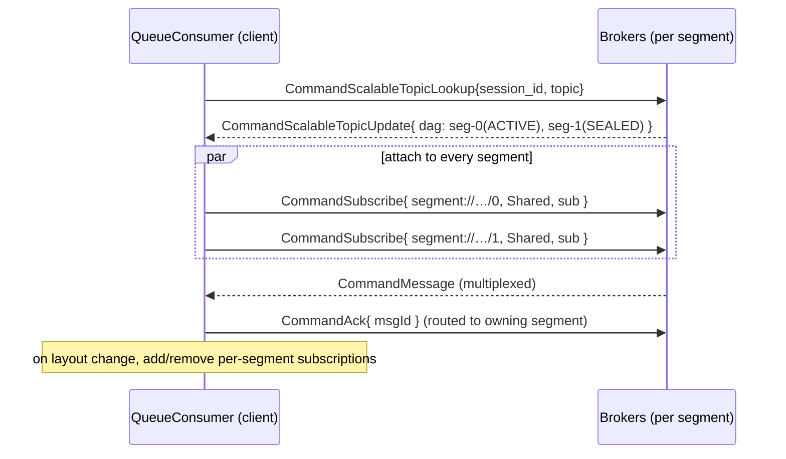
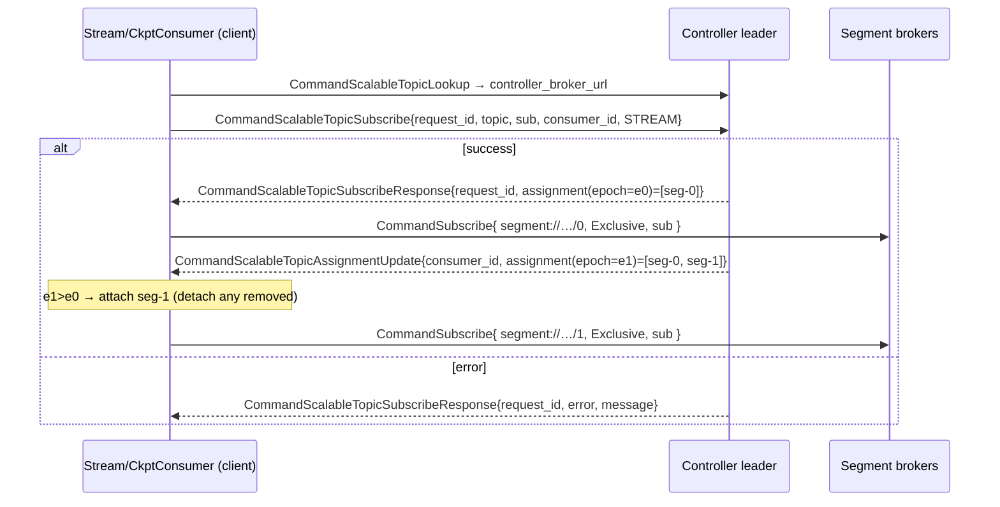
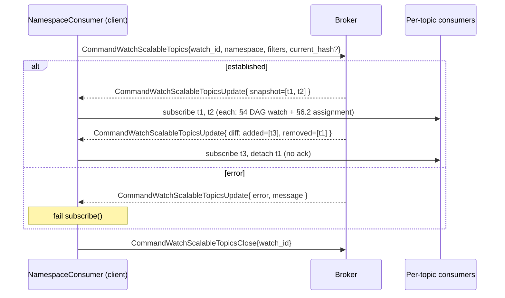
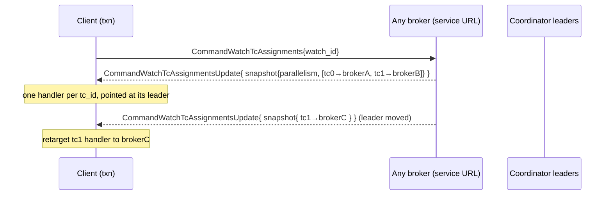
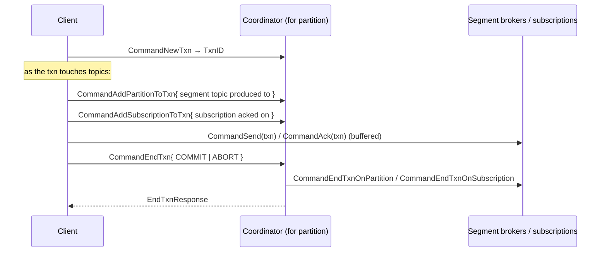
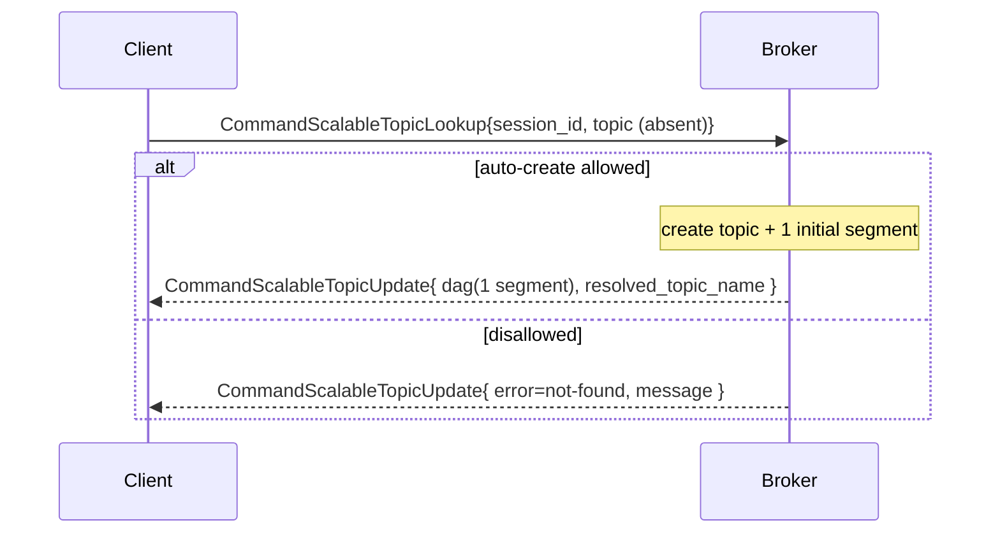

# Wire Protocol

**Status:** Draft (targeting Stable)

This document specifies the **complete** client↔broker protocol for scalable topics: every command, its
fields, and every interaction (with sequence diagrams). It binds the transport-agnostic
[Client API](client-api.md) to the Apache Pulsar binary protocol.

All commands are defined in `pulsar-common/src/main/proto/PulsarApi.proto` and are carried inside
`BaseCommand`. Standard Pulsar framing, `CommandConnect`/auth, lookup, and the
producer/consumer/`Send`/`Ack` commands are **reused unchanged** except where noted; this document
specifies only the scalable-topic-specific exchanges and how the reused ones are applied at the
**segment** level.

Conventions: `C→B` = client to broker, `B→C` = broker to client. Field names match the proto. A field
shown `field?` is optional.

## 1. Command catalog

The scalable-topic command family occupies `BaseCommand` field numbers 70–82:

| Command | # | Direction | Purpose |
|---------|---|-----------|---------|
| `CommandScalableTopicLookup` | 70 | C→B | Open a DAG-watch session; resolve a topic. |
| `CommandScalableTopicUpdate` | 71 | B→C | Initial layout **and** every subsequent pushed layout change. |
| `CommandScalableTopicClose` | 72 | C→B | Close a DAG-watch session. |
| `CommandScalableTopicSubscribe` | 73 | C→B | Register an ordered (Stream) / external (Checkpoint) consumer; request assignment. |
| `CommandScalableTopicSubscribeResponse` | 74 | B→C | Initial segment assignment, or error. |
| `CommandScalableTopicAssignmentUpdate` | 75 | B→C | Push a new assignment after a rebalance. |
| `CommandWatchScalableTopics` | 76 | C→B | Open a namespace membership watch. |
| `CommandWatchScalableTopicsUpdate` | 77 | B→C | Snapshot or diff of the matching topic set, or error. |
| `CommandWatchScalableTopicsClose` | 78 | C→B | Close a namespace watch. |
| `CommandWatchTcAssignments` | 79 | C→B | Open the transaction-coordinator discovery watch. |
| `CommandWatchTcAssignmentsUpdate` | 80 | B→C | Full TC `partition → leader` snapshot, or error. |
| `CommandWatchTcAssignmentsClose` | 81 | C→B | Close the TC discovery watch. |
| `CommandScalableTopicUnsubscribe` | 82 | C→B | Cleanly leave a subscription; the controller unregisters and rebalances immediately. Acked with `CommandSuccess`. |

Reused (standard) commands applied at the segment level: `CommandProducer`/`CommandSend`,
`CommandSubscribe`/`CommandFlow`/`CommandMessage`/`CommandAck`, the reader commands, the transaction
commands (`CommandNewTxn`, `CommandAddPartitionToTxn`, `CommandAddSubscriptionToTxn`, `CommandEndTxn`
and the `…OnPartition`/`…OnSubscription` variants), and schema commands.

## 2. Shared structures

```
ScalableTopicDAG {
  uint64 epoch                          // monotonic layout version
  repeated SegmentInfoProto segments
  repeated SegmentBrokerAddress segment_brokers   // segment_id -> broker_url[/_tls]
  string controller_broker_url[/_tls]             // controller leader for this topic
}
SegmentInfoProto {
  uint64 segment_id
  uint32 hash_start, hash_end           // inclusive 16-bit range owned by the segment
  SegmentState state                    // ACTIVE | SEALED
  repeated uint64 parent_ids, child_ids // split/merge lineage (DAG edges)
  uint64 created_at_epoch [, sealed_at_epoch]     // DAG generation numbers
  uint64 created_at_ms    [, sealed_at_ms]        // wall clock (retention GC, timestamp seek)
  string legacy_topic_name?             // set => wraps an external persistent:// topic (migration)
  repeated uint32 entry_bucket_splits   // PIP-486 (field 12): ascending inclusive start hashes of
                                        // buckets 1..N-1; empty => one bucket spanning the ring
}
```

A client MUST treat `epoch` as the monotonic version of a layout and ignore any update whose epoch is
not greater than the last applied (guards against reordered/stale pushes). The set of `ACTIVE` segments
whose `[hash_start, hash_end]` ranges tile `0x0000`–`0xFFFF` is the current write surface; `SEALED`
segments remain readable until drained.

## 3. Segment naming

A managed segment's `segment://` topic name is computed from the parent topic and a descriptor:

```
segment://<tenant>/<namespace>/<parent-local-name>/<hexStart>-<hexEnd>-<segmentId>
descriptor = format("%04x-%04x-%d", hash_start, hash_end, segment_id)
e.g.  segment://tenant/ns/my-topic/0000-ffff-0   (full range, single segment)
      segment://tenant/ns/my-topic/0000-7fff-1   (lower half)
```

For a **legacy** segment (`legacy_topic_name` set — the synthetic layout wrapping a `persistent://`
topic during migration) there is no `segment://` name; the client targets the wrapped `persistent://`
name directly.

## 4. Topic resolution and the DAG-watch session

A producer or queue consumer opens a **DAG-watch session** to resolve the topic and receive its layout
plus live updates. The session is identified by a client-assigned `session_id`.

```
CommandScalableTopicLookup { session_id, topic }
CommandScalableTopicUpdate { session_id, dag?: ScalableTopicDAG, error?, message?, resolved_topic_name? }
CommandScalableTopicClose  { session_id }
```

- `topic` accepts `topic://`, `persistent://`, or short form; the broker normalizes it and returns the
  canonical identity in `resolved_topic_name` (set on every success update). The client MUST use that
  downstream.
- The **same** `CommandScalableTopicUpdate` is used for the initial response and for every pushed change.
  The broker streams a new one on every layout change (split/merge, broker reassignment).
- **Establishment can fail**: if resolution fails (topic not found and auto-create disallowed,
  authorization denied), the first update sets `error`/`message` with no `dag`; the client MUST surface
  this as a create/subscribe failure.
- On connection loss the client re-sends `CommandScalableTopicLookup` (with backoff) to re-establish the
  watch and refresh the layout before resuming.



## 5. Producing

The producer resolves the layout (§4), then for each message selects the target **segment** with the
client-side router and produces to it with the standard `CommandProducer`/`CommandSend` flow.

**Routing (client-side — MUST match exactly so all clients route a key identically):**

1. **Keyed:** `hash = raw_Murmur3_32(key_utf8) >>> 16` — the **high** 16 bits of the raw (unmasked)
   32-bit Murmur3 hash; select the single `ACTIVE` segment whose `[hash_start, hash_end]` contains
   `hash`. (The raw hash is used so the high half is full-range; the **low** 16 bits are reserved as
   the key's *entry-bucket* hash — [Key-Shared](key-shared.md) §2 — so the two routings are
   independent.)
2. **Keyless:** round-robin across the active segments.
3. **All-legacy (synthetic) layout:** `signSafeMod(Murmur3_32(key_utf8), N)` over the `N` legacy
   segments (identical to v4 partitioned-topic routing, preserving key→partition while migrating).

The per-segment `CommandProducer` is opened lazily on first send to a segment (named
`<producerName>-seg-<segment_id>`), against the owning broker from `segment_brokers`. When a pushed
update **seals** the target segment, the client MUST drop that per-segment producer, re-route to the
active successor, and continue — preserving per-key order (see the transparent retry in
[Implementation Requirements](client-behavior.md)).



## 6. Consuming

### 6.1 Queue consumer — attach to all segments (no assignment protocol)

A queue consumer is driven by the DAG watch (§4). It opens a standard **`CommandSubscribe` (Shared)**
against **every** active *and* sealed segment topic, multiplexes deliveries, and individually acks
(routing each ack to the per-segment consumer via the segment id encoded in the `MessageId`). As the
layout changes it adds/removes per-segment subscriptions.



### 6.2 Stream / grouped-checkpoint consumer — controller assignment

Ordered (Stream) and grouped-Checkpoint consumers register with the **controller leader** and are
handed an explicit segment assignment. The controller leader's URL comes from the DAG layout
(`controller_broker_url`); the client connects to it **directly** (scalable-topic URIs are not
resolvable through the standard v4 lookup service).

```
CommandScalableTopicSubscribe { request_id, topic, subscription, consumer_name, consumer_id,
                                consumer_type: STREAM | CHECKPOINT }
CommandScalableTopicSubscribeResponse { request_id, assignment?: ScalableConsumerAssignment, error?, message? }
CommandScalableTopicAssignmentUpdate  { consumer_id, assignment: ScalableConsumerAssignment }

ScalableConsumerAssignment { uint64 layout_epoch; repeated ScalableAssignedSegment segments }
ScalableAssignedSegment    { uint64 segment_id; uint32 hash_start, hash_end; string segment_topic;
                             repeated IntRange bucket_ranges }
```

- `consumer_id` is client-chosen and tags every subsequent pushed `CommandScalableTopicAssignmentUpdate`;
  `request_id` matches the subscribe response.
- The client attaches to exactly the `segment_topic`s in its current assignment — **Stream** via a
  standard `CommandSubscribe`, **grouped Checkpoint** via a Reader — and detaches from segments
  removed by a later assignment.
- `bucket_ranges` selects the Stream consumer's attach mode per segment (entry-bucketing,
  [Key-Shared](key-shared.md) §4): **empty** ⇒ sole owner, subscribe **Exclusive**; **non-empty** ⇒ the
  segment is shared by entry-bucket, and the list is the segment's full bucket-boundary list — the
  consumer subscribes `Key_Shared` STICKY with `KeySharedMeta.entryBucketDispatch = true` and exactly
  this list in `KeySharedMeta.hashRanges`. The controller may share a segment whenever consumers
  outnumber segments, so a Stream client MUST implement this handling. Before applying a mode flip (or
  dropping a segment) the client MUST drain the segment — see [Key-Shared](key-shared.md) §4.
- `layout_epoch` lets the client **reject stale** assignments (apply only if epoch ≥ last applied).
- Rebalances are pushed when a peer joins/leaves the subscription or on a segment split/merge.



**Reconnect / grace.** On connection loss after the initial assignment, the client re-runs
lookup → connect-to-controller → register → subscribe with backoff. Within the controller's grace
period the broker re-attaches the existing registration and returns the **same** assignment (no
listener-visible change); past grace, the controller rebalances and the client applies the diff (detach
removed, attach added).

**Clean leave.** Closing a consumer MUST send `CommandScalableTopicUnsubscribe { request_id,
consumer_id }` on the registration's connection: the controller deletes the registration and
rebalances the remaining consumers immediately, instead of holding the session for the grace period.
This is REQUIRED, not an optimization — the controller connection is pooled, so a consumer's close is
otherwise invisible while its client process lives (no `channelInactive`), and the registration would
linger indefinitely. The command is acknowledged with `CommandSuccess` and is idempotent (an unknown
`consumer_id` — e.g. already swept by a disconnect — still succeeds); the client treats it as
best-effort and MUST NOT fail the close if it errors, since the grace period remains the fallback for
unclean departures.

### 6.3 Ungrouped checkpoint consumer

No registration: the client reads **all** segments from its start position directly with per-segment
Readers (driven by the DAG watch), tracking positions locally; a *checkpoint* serializes the per-segment
read positions of its segment set.

## 7. Namespace / multi-topic watch

A namespace-subscribing Stream consumer discovers its topic set via a membership watch.

```
CommandWatchScalableTopics       { watch_id, namespace, property_filters[], current_hash? }
CommandWatchScalableTopicsUpdate { watch_id, oneof{ snapshot: ScalableTopicsSnapshot | diff: ScalableTopicsDiff }, error?, message? }
CommandWatchScalableTopicsClose  { watch_id }
```

- `property_filters` are AND filters over topic properties; empty ⇒ all topics in the namespace.
- The subscribe opens a **server-side stream of updates** (not request/response). **Establishment can
  fail** — namespace not found, authorization denied — in which case the first update sets
  `error`/`message` and the client MUST fail `subscribe()`.
- On success the first update carries a `ScalableTopicsSnapshot` (full set; the client replaces its
  local set); subsequent changes are a `ScalableTopicsDiff` (apply `removed` before `added`).
- `current_hash` (CRC32C over sorted topic names, same function as `CommandGetTopicsOfNamespace`) is
  sent on reconnect; if it matches the broker's freshly computed hash, the broker skips re-sending the
  snapshot.

For **each** topic in the set the client runs an independent per-topic DAG watch (§4) and assignment
(§6.2), multiplexing into one receive queue; cumulative ack uses a position vector spanning
`{topic → {segmentId → messageId}}`. On a diff: subscribe **added** topics; for **removed**, detach the
per-topic consumer without acknowledging — acks are always explicit ([Client Behavior](client-behavior.md) §6).



## 8. Transactions

Transaction **lifecycle** uses the standard transaction commands; only **coordinator discovery** is
scalable-topic-specific.

### 8.1 Coordinator discovery — watch, not lookup

Against a broker advertising `supports_tc_metadata_discovery`, the client opens **one** assignment watch
instead of per-coordinator lookups.

```
CommandWatchTcAssignments      { watch_id }
CommandWatchTcAssignmentsUpdate { watch_id, snapshot?: TcAssignmentsSnapshot, error?, message? }
CommandWatchTcAssignmentsClose { watch_id }

TcAssignmentsSnapshot { uint32 parallelism; repeated TcAssignment assignments }
TcAssignment          { uint64 tc_id; string broker_service_url[/_tls] }
```

- The broker replies with the **full** `partition → leader` map and re-pushes the **whole** snapshot on
  every leadership change (no diffs, no point lookup). The client replaces its map wholesale.
- `tc_id` is the coordinator partition (`TxnID.mostSigBits`); the client keeps one handler per partition
  pointed at its current leader, retargeted on each snapshot.
- A partition **mid-election** is absent from the snapshot; a transaction routed to it is **parked**
  until a later snapshot fills it in.



### 8.2 Lifecycle (standard commands, at segment level)



A transaction's *partition* set is the set of **segment topics** it actually wrote to; a split/merge
during an open transaction simply means later writes add the successor segment as another partition.

## 9. Auto-creation

Auto-creation is not a separate command — it happens inside topic resolution (§4) / subscribe (§6).
When the topic does not exist, the broker creates it (single initial segment) **iff** policy allows and
then returns the layout/assignment; otherwise it returns `error = not-found`. The client surfaces the
outcome as the result of `create()`/`subscribe()`.



## 10. Reused subsystems

`CommandConnect`/auth, TLS, schema negotiation (`CommandGetSchema`/`CommandGetOrCreateSchema`), broker
lookup, and `CommandSend`/`CommandAck` framing are the standard Pulsar protocol, applied at the
**segment** topic level (`segment://`, or the wrapped `persistent://` for legacy segments). No
scalable-topic-specific changes are required to them.

## 11. Cross-cutting requirements

- **Epoch monotonicity.** For every layout (`ScalableTopicDAG.epoch`) and assignment
  (`ScalableConsumerAssignment.layout_epoch`), a client MUST apply an update only if its epoch is ≥ the
  last applied, discarding stale/reordered pushes.
- **Watch establishment errors.** Each of the three watch families (DAG §4, namespace §7, TC §8) reports
  an establishment failure via `error`/`message` in its first update; a client MUST surface it as the
  failure of the operation that opened the watch.
- **Reconnect.** Each session (DAG watch, assignment, namespace watch, TC watch) re-establishes with
  backoff on connection loss and re-syncs via a fresh snapshot/layout; in-progress producers/consumers
  MUST NOT be invalidated (see [Client API](client-api.md) §2).
